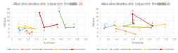

Micromalloc has been benchmarked against various allocators for several scenarios. These benchmarks are available in the library, and were mostly used to tune and correct the allocator.
This section presents 3 types of benchmarks and compares micromalloc to glibc malloc (v2.17), jemalloc (v5.3.0), mimalloc (v1.8) and snmalloc (v3.14).
Code was compiled with gcc 10.3.0 and ran on a Linux CentOS 7. The machine is equipped with a Intel(R) Xeon(R) Gold 5220R CPU @ 2.20GHz, 95 processors.

Allocate/deallocate in the same threads
---------------------------------------

This straightforward benchmark spawn X threads (from 1 to 10). Each thread first allocates several blocks of random size, and then deallocate all of them in allocation order. 
Therefore, the benchmark should display the raw performances and scalability of each allocator without complicated patterns like cross thread deallocation. For arena based allocators, we expect an almost linear scalability with the number of threads.

The following curves display, for each allocator, the memory overhead (abscissa, ratio of memory_usage/requested_memory) and number of operations per second (ordinate, expressed in millions of operations/second).
The left plot uses random allocation sizes from 0 (valid for all allocators) to 500. The right plot uses random allocation sizes from 0 to 5000.


As expected, most allocators (including micromalloc) show an almost linear scalability based on the number of threads. But the first surprise comes from glibc malloc that displays a *negative scalability!* 
Indeed, the top point (for the left and right plots) is for one thread only, and performances decrease with the number of threads. In term of pure speed, snmalloc and jemalloc offer the best performances.

In terms of memory overhead, this benchmark should display the minimal overhead that each allocator can reach. Micromalloc is very close in this regard to glibc, but with better performances. 


Allocate/deallocate in the separate threads
-------------------------------------------

This benchmark tests allocators scalabililty and memory overhead with cross thread deallocations.

It starts with a vector of null pointers. The benchmark spawns X threads (from 0 to 10) that walk through the vector in a random order.
Whenever a null pointer is found, it allocates a random sized memory chunk. If the pointer is not null, it deallocates it and set it to null. Each thread walks several times through the vector applying this allocation pattern.
Therefore, allocated chunks will be deleted by a random thread, and most of the time not the one that allocated it. This is usually where most allocators differ in their implementation, as they almost all provide custom strategies to cope with cross-thread deallocations: free-list sharding for mimalloc, message passing for snmalloc...

The left plot uses random allocation sizes from 0 to 500, the right plot uses random sizes from 0 to 5000. For clarity, only the tests with 2, 4 and 8 threads are displayed.



Once again, snmalloc and jemalloc show the best performances in term of speed, at the expense of a high memory usage, up to ~1.7
Micromalloc displays lower performances (still higher than glibc), but with the lowest memory overhead. 
Micromalloc does not provide custom strategies to cope with cross thread deallocation, but the internal scalability of the radix tree makes up for it. The best-fit policy combined with the arena depletion strategy are enough to keep a low memory overhead on all tested scenarios.


Larson benchmark
----------------

This benchmark is a more standard one that comes from the <a href="https://github.com/daanx/mimalloc-bench">mimalloc benchmark suite</a>. 
It simulates a typical server workload: each thread allocates and deallocates objects, and then transfers some objects (randomly selected) to other threads to be freed.

The following figure displays Larson benchmark results for up to 10 threads, with random allocation sizes between 0 and 500. The memory overhead is not given as the allocated memory peak is very low


Simple usage on Linux (open a file with gedit):
```console
mp gedit my_file.txt
```
This will launch gedit tool and pass the *my_file.txt* argument to the software.

It is possible to pass arguments to *mp* before the actual command line to launch. These arguments MUST be on the form *MICRO_...* and use the same names as environment variables used to configure micro library.

Another example that will print some memory statistics at exit of gedit:

```console
mp MICRO_PRINT_STATS=stdout MICRO_PRINT_STATS_TRIGGER=1 gedit my_file.txt
```

The *mp* tool can launch programs using a file as memory provider. In the below example, we start the Kate text editor in this mode, and specify the folder in which page files are created:

```console
mp MICRO_PRINT_STATS=stdout MICRO_PRINT_STATS_TRIGGER=1 MICRO_PROVIDER_TYPE=3 MICRO_PAGE_FILE_PROVIDER_DIR=~/pages MICRO_PAGE_FILE_FLAGS=1 kate
```

The page provider type is set to 3 (file provider) using the MICRO_PROVIDER_TYPE environment variable.
We use a MICRO_PAGE_FILE_FLAGS of 1 to allow file growing on memory demand.
All created page files are stored in the folder '~/pages' that must already exist.