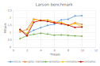

Micromalloc has been benchmarked against various allocators for several scenarios. These benchmarks are available in the library, and were mostly used to tune and correct the allocator.
This section presents 3 types of benchmarks and compares micromalloc to glibc malloc (v2.17), jemalloc (v5.3.0), mimalloc (v1.8) and snmalloc (v3.14).
Code was compiled with gcc 10.3.0 and ran on a Linux CentOS 7. The machine is equipped with a Intel(R) Xeon(R) Gold 5220R CPU @ 2.20GHz, 95 processors.

We clear ALL allocated memory at the end of each benchmark and this is counted in the performance measurement. Indeed most allocators do not always free pages on deallocation in order to speed up further allocations, as page allocation is usually a time consuming operation.
This is fine when the allocator is used to speedup one application, but (in my opinion) inefficient when replacing the default allocator system wide as it will consume a LOT of additional memory. 
Default allocators like glibc malloc or (especially) Windows Low-fragmentation Heap will decommit (but not necessarily release) pages as soon as possible to decrease global memory usage. Micromalloc will decommit pages as soon as they do not contain used chunks.

Therefore:
-	jemalloc is configured with `dirty_decay_ms:0,muzzy_decay_ms=0`. This is the only way I found to ensure immediate page decommitment (I think?)
-	for mimalloc, we use `mi_heap_collect(mi_heap_get_default(), true)`
-	for glibc malloc we call `malloc_trim(0)` (not sure this works as intended)
-	for micromalloc we call `micro_clear()`
-	for snmalloc, I did not find a way to do it properly.

Allocate/deallocate in the same threads
---------------------------------------

This straightforward benchmark spawn X threads (from 1 to 10). Each thread first allocates several blocks of random size, and then deallocate all of them in allocation order. 
This benchmark is not a realistic scenario encountered in applications, but should display the raw performances and scalability of each allocator without complicated patterns like cross thread deallocation. For arena based allocators, we expect an almost linear scalability with the number of threads.

The following curves display, for each allocator, the memory overhead (abscissa, ratio of memory_usage/requested_memory) and number of operations per second (ordinate, expressed in millions of operations/second).
The left plot uses random allocation sizes from 0 (valid for all allocators) to 500. The right plot uses random allocation sizes from 0 to 5000.

As expected, most allocators (including micromalloc) show an almost linear scalability based on the number of threads. But the first surprise comes from glibc malloc that displays a *negative scalability!* 
Indeed, the top point (for the left and right plots) is for one thread only, and performances decrease with the number of threads. In term of pure speed, snmalloc and jemalloc offer the best performances.

In terms of memory overhead, this benchmark should display the minimal overhead that each allocator can reach. Micromalloc is very close in this regard to glibc, but with better performances. 

Allocate/deallocate in separate threads
---------------------------------------

This benchmark tests allocators scalabililty and memory overhead with cross thread deallocations.

It starts with a vector of null pointers. The benchmark spawns X threads (from 1 to 10) that walk through the vector in a random order.
Whenever a null pointer is found, it allocates a random sized memory chunk. If the pointer is not null, it deallocates it and set it to null. Each thread walks several times through the vector applying this allocation pattern.
Therefore, allocated chunks will be deleted by a random thread, and most of the time not the one that allocated it. This is usually where most allocators differ in their implementation, as they almost all provide custom strategies to cope with cross-thread deallocations: free-list sharding for mimalloc, message passing for snmalloc...

The left plot uses random allocation sizes from 0 to 500, the right plot uses random sizes from 0 to 5000. For clarity, only the tests with 2, 4 and 8 threads are displayed.

Once again, snmalloc and jemalloc show the best performances in term of speed, at the expense of a high memory usage, up to ~1.7
Micromalloc displays lower performances (still higher than glibc), but with the lowest memory overhead. 
Micromalloc does not provide custom strategies to cope with cross thread deallocation, but the internal scalability of the radix tree makes up for it. The best-fit policy combined with the arena depletion strategy are enough to keep a low memory overhead on all tested scenarios.

Larson benchmark
----------------

This benchmark is a more standard one that comes from the <a href="https://github.com/daanx/mimalloc-bench">mimalloc benchmark suite</a>. 
It simulates a typical server workload: each thread allocates and deallocates objects, and then transfers some objects (randomly selected) to other threads to be freed.

The following figure displays Larson benchmark results for up to 10 threads, with random allocation sizes between 0 and 500. The memory overhead is not given as the allocated memory peak is very low compared to the overhead introduced by a lot of thread creation/destruction.

Micromalloc seems to scale well compared to the other allocators. This might be a measurement of the way threads are handled by each allocator. The Larson benchmark creates and destroys LOTs of threads that perform a low amount of operations.
If an allocator heavily rely on thread local metadata with non straightforward initialization/destruction, it will perform poorly on the Larson becnhmark. As opposed to micromalloc that only affect a unique Id to spawn threads, and use this Id to select an arena.

Other benchmarks
----------------

The `benchs` folder of contains additional benchmark were micromalloc performs quite well, but the exact memory overhead of each allocator is harder to extract without impacting the real performances. 
These benchmarks were taken from other git repositories, check the README for their addresses. 
